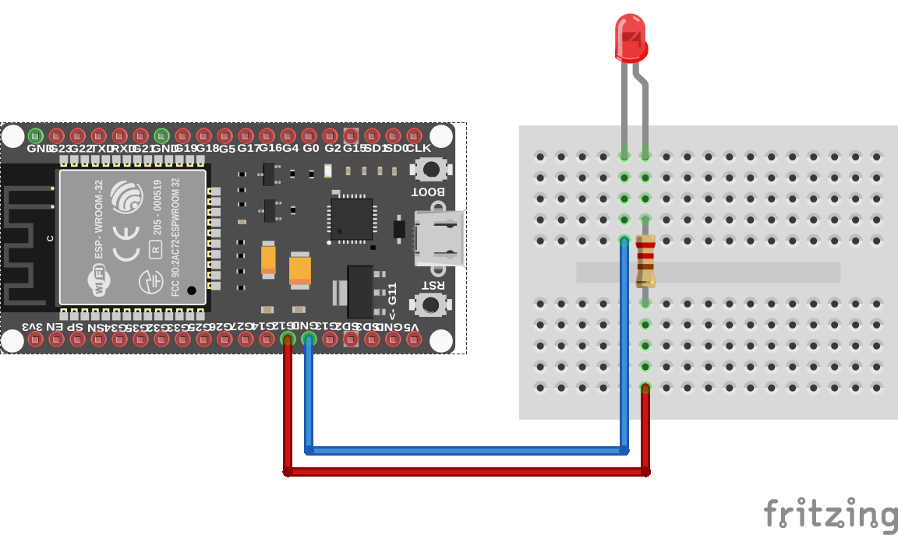

# Blink

## LED dióda

Mikrokontrolér _ESP32_ má spolu _38_ pinov, z čoho GPIO piny sú piny _0-19_, _21-23_, _25-27_ a _32-39_. Niektoré piny však majú obmedzenia:

- piny *1* a *3* sú pre *REPL UART TX* a *RX*
- piny *6*, *7*, *8*, *11*, *16*, a *17* sa používajú pre pripojenie zabudovanej *flash* a neodporúčajú sa pre iné použitie
- piny *34-39* sú len vstupné a nemajú interné *pull-up* rezistory

* digitálny výstup
* zapojenie anódy a katódy
* predradný odpor

## Schéma zapojenia

_LED_ dióda je pripojená na GPIO pin č. _10_ mikrokontroléra _ESP32_. Katóda je priamo pripojená na pin označený ako _GND_ (zem). Medzi GPIO pinom a anódou je pripojený odpor o veľkosti _220_ ohmov. Schéma zapojenia sa nachádza na nasledujúcom obrázku:



## REPL

Z balíka `machine` importujeme triedu `Pin`:

```python
>>> from machine import Pin
```

Vytvoríme objekt triedy `Pin`, ktorý bude reprezentovať _LED_ diódu. Konštruktor triedy `Pin` má tieto parametre:

* `id` - povinný parameter, ktorý identifikuje pin, a
* `mode` - režim pin-u, ktorý môže byť
  * `Pin.IN` - pin pre vstup, a
  * `Pin.OUT` - pin pre výstup.

**Poznámka:** Trieda `Pin` má výrazne viac možností konfigurácie a práce. Pre podrobnejšie informácie sa pozrite do [dokumentácie](https://docs.micropython.org/en/latest/library/machine.Pin.html).

Výsledný kód pre vytvorenie výstupného pin-u na pin-e č. _10_ bude vyzerať nasledovne:

```python
>>> led = Pin(10, Pin.OUT)
```

Pre prácu s diódou, resp. všeobecne s pin-om, máme k dispozícii niekoľko metód. Ak chceme získať aktuálny stav pin-u, zavoláme metódu `value()`:

```python
>>> led.value()
0
```

**Poznámka:** Pin sme pri jeho vytváraní nijako neinicializovali, takže hodnota na pin-e v skutočnosti nemusí byť `0`.

Pomocou metódy `value()` však môžeme aj hodnotu na pin zapísať. Ak chceme _LED_ diódu pripojenú na tento pin zasvietiť, do metódy `value()` zapíšeme ako parameter hodnotu `1`:

```python
>>> led.value(1)
```

Ak následne chceme _LED_ diódu zhasnúť, do metódy `value()` vložíme ako parameter hodnotu `0`:

```python
>>> led.value(0)
```

Trieda `Pin` však umožňuje nad svojimi inštanciami volať aj priamo metódu `on()` na zasvietenie (alternatíva pre `value(1)`) a metódu `off()` pre zhasnutie (alternatíva pre `value(0)`).

```python
>>> led.on()
>>> led.off()
```

## Riešenie

V nasledujúcom výpise sa nachádza kód jednoduchého blikača _LED_ diódy pomocou mikrokontroléra _ESP32_. _LED_ dióda je podľa schémy pripojená na GPIO pin č. _10_. Pomocou funkcie `sleep()` zabezpečíme pozastavenie vykonávania programu po dobu _2_ a _1_ sekundy.


```python
from machine import Pin
from time import sleep

led = Pin(10, Pin.OUT)
while True:
    led.on()
    sleep(2)
    led.off()
    sleep(1)
```

## Ďalšie úlohy

1. Vytvorte funkciu `blink()`, ktorá na dobu _2_ sekundy _LED_ diódu rozsvieti a následne ju zhasne.
2. Vytvorte triedu `LED`, ktorá bude potomkom triedy `Pin` a bude obsahovať aj metódu `blink()`.
3. Ku _LED_ dióde pripojte tlačidlo, ktorým po stlačení diódu zasvietite a po následnom stlačení diódu zhasnete.
4. Pripojte k _LED_ dióde druhú diódu a vytvorte blikač, kedy keď jedna dióda nesvieti, bude svietiť druhá a naopak.
5. Miesto použitia funkcie `sleep()` mikrokontrolér uspite a na jeho zobudenie využite časovač.

## Ďalšie zdroje

* [class Pin](https://docs.micropython.org/en/latest/library/machine.Pin.html) -  control I/O pins

## Licencia

Pokiaľ nie je uvedené inak, obsah tohto dokumentu je licencovaný licenciou [Creative Commons Attribution-NonCommercial-ShareAlike 4.0 International (CC BY-NC-SA 4.0)](https://creativecommons.org/licenses/by-nc-sa/4.0/).

   