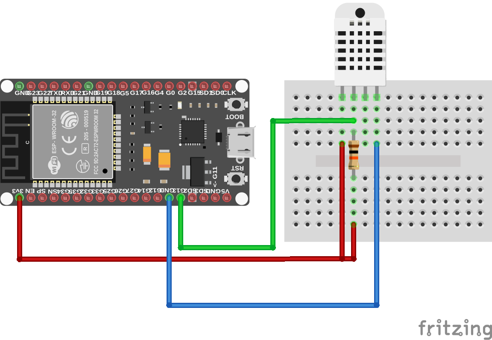

# Meranie teploty a vlhkosti so senzorom DHT11/22

## Senzory DHT11/22

* podpora priamo v micropython-e

## Schéma zapojenia

Pre tento lab je použitý senzor _DHT22_ so štyrmi pinmi. Dátový pin je privedený na GPIO pin _13_ mikrokontroléra _ESP32_. Medzi dátovým pinom a napájaním sa nachádza _10k_ odpor. Schéma zapojenia je zobrazená na nasledujúcom obrázku:



## REPL

Začneme tým, že z balíka `machine` importujeme triedu `Pin` a z balíka `dht` importujeme triedu `DHT22`:

```python
>>> from machine import Pin
>>> from dht import DHT22
```

Ak by sme miesto senzoru _DHT22_ mali k dispozícii senzor _DHT11_, importujeme triedu `DHT11`:

```python
>>> from dht import DHT11
```

Dátový pin na _DHT_ senzore je podľa schémy pripojený na GPIO pin _13_ mikrokontroléra _ESP32_. Vytvoríme teda objekt reprezentujúci senzor _DHT22_ nasledujúcim príkazom:

```python
>>> sensor = DHT22(Pin(13))
```

Ak sa pozrieme na zoznam metód, ktoré je následne možné nad objektom senzoru volať, nájdeme aj metódy `temperature()` a `humidity()`. Prvá z nich vráti hodnotu teploty získanej zo senzora a druhá zasa hodnotu vlhkosti. Pred ich volaním je však vždý potrebné zavolať metódu `measure()`, ktorá tieto hodnoty odmeria a zapamätá si ich. Metódy `temperature()` a `humidity()` teda iba vrátia hodnoty namerané, resp. získané po volaní metódy `measure()`!

```python
>>> sensor.measure()
>>> sensor.temperature()
25.4
>>> sensor.humidity()
46.0
```

**Poznámka:** Kôli vyššej presnosti nie je možné na senzore _DHT11_ merať častejšie ako každú sekundu a na senzore _DHT22_ častejšie ako každé _2_ sekundy.

## Riešenie

Kompletné riešenie pre odmeranie aktuálnej teploty a vlhkosti je možné vidieť v nasledujúcom fragmente kódu:


```python
from machine import Pin
from dht import DHT22

sensor = DHT22(Pin(13))
sensor.measure()
print(sensor.temperature())
print(sensor.humidity())
```

## Ďalšie úlohy

1. Pripojte LED diódu ku niektorému z digitálnych pinov. Pred začatím každého merania LED diódu rozsvieťte a po jeho skončení ju zhasnite.
2. Pripojte k niektorému z digitálnych vstupných pinov tlačidlo. Zabezpečte, aby sa teplota odčítala zakaždým, keď sa tlačidlo stlačí.
3. Pripojte ku obvodu (aspoň) dvojriadkový displej. Na vrchný riadok vypíšte teplotu a na dolný riadok vypíšte vlhkosť.
4. Miesto pravidelného snímania v nekonečnej slučke a časovania pomocou funkcie `sleep()`, uveďte mikrokontrolér do vhodného režimu spánku a pomocou časovača ho vo vhodný okamih zobuďte.
5. Vypublikujte zosnímané hodnoty do niektorej z otvorených služieb ako napr. [Watson IoT Platform](https://www.ibm.com/internet-of-things/solutions/iot-platform/watson-iot-platform).

## Ďalšie zdroje

* [DHT22 - SparkFun Electronics](https://www.sparkfun.com/datasheets/Sensors/Temperature/DHT22.pdf) - datasheet
* [Temperature and Humidity](https://docs.micropython.org/en/latest/esp8266/tutorial/dht.html) - dokumentácia modulu `dht`
* [Interface DHT11 DHT22 with ESP32 & Display Values Using Web Server](https://lastminuteengineers.com/esp32-dht11-dht22-web-server-tutorial/)
* [ESP32 with DHT11/DHT22 Temperature and Humidity Sensor using Arduino IDE](https://randomnerdtutorials.com/esp32-dht11-dht22-temperature-humidity-sensor-arduino-ide/)

## Licencia

Pokiaľ nie je uvedené inak, obsah tohto dokumentu je licencovaný licenciou [Creative Commons Attribution-NonCommercial-ShareAlike 4.0 International (CC BY-NC-SA 4.0)](https://creativecommons.org/licenses/by-nc-sa/4.0/).

   