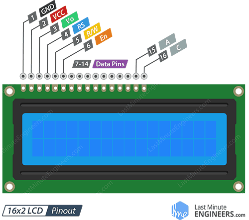

# Display LCD 1602

## Display LCD 1602



## I2C Module

Displej je možné osadiť aj _I2C_ modulom, vďaka čomu miesto _16_ pinov budete môcť použiť len _4_. Tento modul je osadený aj potenciometrom, ktorým môžete regulovať kontrast na displeji:


## Schéma zapojenia

Pre tento lab je použitý displej _LCD 1602_ s _I2C_ modulom. Tým miesto _16_ pinov bude stačiť použiť len _4_.


## Bootstrap

Ešte predtým, ako sa pustíme do práce, si stiahneme potrebné súbory z knižnice _LCD API_, vďaka čomu sa práca s displejom značne zjednoduší.

Zo [stránky projektu](https://github.com/dhylands/python_lcd) na serveri [GitHub](https://github.com) stiahnite a následne do mikrokontroléra _ESP32_ nahrajte tieto súbory:

* [`esp8266_i2c_lcd.py`](https://github.com/dhylands/python_lcd/blob/master/lcd/esp8266_i2c_lcd.py)
* [`lcd_api.py`](https://github.com/dhylands/python_lcd/blob/master/lcd/lcd_api.py)

Následne môžeme vyskúšať funkcionalitu pomocou dema, ktoré sa nachádza v súbore [esp8266_i2c_lcd_test.py](https://github.com/dhylands/python_lcd/blob/master/lcd/esp8266_i2c_lcd_test.py). Pokiaľ na displeji nič nevidíte, skúste potočiť potenciometrom na jednu alebo druhú stranu.

## REPL

Začneme tým, že z balíka `machine` importujeme triedy `Pin` a `I2C`:

```python
>>> from machine import I2C, Pin
```

Následne vytvoríme inštanciu `I2C` zariadenia, ktoré je zapojené na pin-och `22` a `21`:

```python
>>> i2c = I2C(scl=Pin(22), sda=Pin(21))
```

Každé zariadenie, ktoré je pripojené k zbernici _I2C_ je možné identifikovať pomocou adresy. Adresa je reprezentovaná celým číslom, pričom žiadne dve zariadenia na _I2C_ zbernici nemôžu mať rovnakú adresu. Ak chceme zistiť, aké zariadenia sú pripojené k _I2C_ zbernici, použijeme metódu `.scan()` nad vytvoreným objektom `i2c`:

```python
>>> i2c.scan()
[39]
```

Výsledkom volania metódy je zoznam s adresami pripojených zariadení. Keďže máme pripojené len jedno zariadenie, bude zoznam obsahovať len jednu položku - adresu pripojeného LCD displeja, ktorá je `39`.

**Poznámka:** Oskenovanie zbernice je aj rýchlou kontrolou správnosti toho, či je všetko v poriadku. Ak totiž bude výsledkom prázdny zoznam, niekde je chyba. Tá môže byť v zapojení, nesprávnom označení pinov pri vytváraní objektu `i2c` alebo v tom najhoršom prípade, poškodenom zariadení.

Keď je všetko v poriadku, môžeme z nahratého modulu importovať triedu `I2cLcd` pre prácu s displejom:

```python
>>> rom esp8266_i2c_lcd import I2cLcd
```

Následne vytvoríme objekt displeja, ktorému odovzdáme niekoľko parametrov:

* objekt `i2c`, pomocou ktorého je možné komunikovať so zariadeniami na _I2C_ zbernici
* adresu zariadenia, v našom prípade hodnotu `39`
* počet riadkov displeja, v našom prípade hodnota `2`
* počet stĺpcov displeja, v našom prípade `16`


```python
>>> lcd = I2cLcd(i2c, 39, 2, 16)
```

Následne už zostáva len pomocou metódy `.putstr()` vypísať na displej správu:

```python
>>> lcd.putstr('Hello world!')
```

## Riešenie

Kompletné riešenie je možné vidieť v nasledujúcom fragmente kódu:


```python
from machine import I2C, Pin
from esp8266_i2c_lcd import I2cLcd

i2c = I2C(scl=Pin(22), sda=Pin(21))
lcd = I2cLcd(i2c, 39, 2, 16)
lcd.putstr('Hello world!')
```

## LCD API

- `I2cLcd(i2c, i2c_address, rows, cols)` - konštruktor, pomocou ktorého je možné vytvoriť inštanciu displeja

  - `i2c` - inštancia triedy `I2C`, ktorá reprezentuje _I2C_ zbernicu
  - `i2c_address` - _I2C_ adresa displeja
  - `rows` - počet riadkov displeja
  - `cols` - počet stĺpcov displeja

- `clear()` - vyčistí obsah LCD displeja a presunie kurzor do ľavého horného rohu

- `show_cursor()` - zviditeľní kurzor

- `hide_cursor()` - skryje kurzor

- `blink_cursor_on()` - zapne kurzor, ktorý bude blikať

- `blink_cursor_off()` - zapne kurzor, ktorý nebude blikať 

- `display_on()` - zapne LCD

- `display_off()` - vypne LCD

- `backlight_on()` - zapne podsvietenie

- `backlight_off()` - vypne podsvietenie

- `move_to(cursor_x, cursor_y)` - presunie kurzor na zadanú pozíciu, pričom číslovanie pozície začína od nuly (napr.: `cursor_x = 0` a `cursor_y = 0` reprezentuje ľavý horný roh)

- `putchar(char)` - vypíše zvolený znak na aktuálnu pozíciu displeja a posunie kurzor na nasledujúcu pozíciu

- `putstr(string)` - vypíše zvolený reťazec na aktuálnu pozíciu displeja a posunie kurzor na nasledujúcu pozíciu

- `custom_char(location, charmap)` - zapíše znak na jednu z _8_ _CGRAM_ pozícií, ktoré sú dostupné pomocou `chr(0)` až `chr(7)`:

  ```python
  # najprv vytvoríme reprezentáciu srdca
  heart = (
      0b00000,
      0b01010,
      0b11111,
      0b11111,
      0b01110,
      0b00100,
      0b00000,
      0b00000
  )
  # zapíšeme ho na CGRAM pozíciu 0
  lcd.custom_char(0, heart)
  # vypíšeme na displej znak z CGRAM pozície 0
  lcd.putchar(chr(0))
  ```

## Ďalšie úlohy

1. Vytvorte funkciu `scroll_text(text)`, ktorá zabezpečí postupné vypisovanie, resp. posúvanie reťazca v jednom riadku od prvého písmenka po posledné.
2. Vytvorte dialóg odpočítavacieho systému pre bombu, ktorý na displeji postupne odráta _10_ sekúnd a miesto detonácie bude rozlične blikať displejom.
3. Využite modul `RTC` tak, aby ste displej premenili na hodiny (reálneho) času:
   * s blikajúcou dvojbodkou v sekundovom intervale, ak budete vypisovať len hodiny a minúty v tvare `HH:MM`
   * bez blikajúcej dvojbodky, ak budete vypisovať aj sekundy v tvare `HH:MM:SS`
4. Pripojte k mikrokontroléru _ESP32_ niektorý zo senzorov a jeho získanú hodnotu zobrazte na displeji.


## Ďalšie zdroje

* [Interfacing 16×2 Character LCD Module with Arduino](https://lastminuteengineers.com/arduino-1602-character-lcd-tutorial/) - This tutorial will cover everything you need to know to get up and running with Character LCDs.
* [python_lcd](https://github.com/dhylands/python_lcd) - Python based library for talking to character based LCDs.
* [How to Use I2C LCD with ESP32 on Arduino IDE (ESP8266 compatible)](https://randomnerdtutorials.com/esp32-esp8266-i2c-lcd-arduino-ide/) - This tutorial shows how to use the I2C LCD (Liquid Crystal Display) with the ESP32 using Arduino IDE.


## Licencia

Pokiaľ nie je uvedené inak, obsah tohto dokumentu je licencovaný licenciou [Creative Commons Attribution-NonCommercial-ShareAlike 4.0 International (CC BY-NC-SA 4.0)](https://creativecommons.org/licenses/by-nc-sa/4.0/).

   
